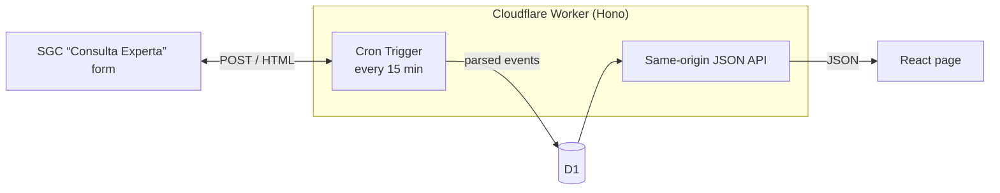

# bvalue-tracker

[](https://github.com/m0t0r/bvalue-tracker/actions/workflows/ci.yml)
[](https://developer.mozilla.org/en-US/observatory/analyze?host=choco.sgc-swarm.workers.dev)

A live monitor for the earthquake sequence in Chocó, Colombia, that followed the
M7.4 San José del Palmar earthquake of 2026-08-10 12:34:27 UTC, and for the
earthquake swarm at Chaparral, Tolima, that began on 2026-09-20. It keeps a
catalogue of each up to date from the Servicio Geológico Colombiano (SGC), and
computes its Gutenberg–Richter **b-value**, over the whole catalogue and over time.

**Live:** <https://choco.sgc-swarm.workers.dev>

The page is written for a Spanish-speaking reader who is interested in the science but
is not a seismologist. It is Spanish first, has an English toggle, and explains its
terms in plain words.

## Features

- **Two zones, one tab each, named by department.** Chocó (the M7.4 sequence) and Tolima (the
  Chaparral swarm) each have their own catalogue, figures and page (`/tolima`), and a shared link previews
  as the zone it opens. Chocó is
  re-read every 15 minutes and Tolima every 30.
- **Up-to-date catalogue.** A Cron Trigger re-reads SGC every 15 minutes, and a
  rotating sweep catches the revisions SGC makes to older events. Events SGC
  withdraws are marked as removed, never deleted.
- **b-value with its caveats.** Magnitude of completeness (Mc) by maximum curvature,
  b with its error bar, b over time with one fixed Mc, and a comparison by magnitude
  type. The page states plainly that a b-value describes the sequence and is not a
  forecast.
- **Two depth clusters.** The sequence splits into a shallow and a deep group. The
  page compares their b-values and daily activity, and can be narrowed to either.
- **Map, charts and table.** Events on a map, magnitude over time, the
  frequency–magnitude distribution and a sortable events table, all driven by one
  set of filters.
- **"Qué está pasando" (`/insights`).** A second page that explains the two zones in plain words to a
  reader in the coffee region who feels the larger events: a scrolling story and a set of questions,
  both drawn with D3 from the live catalogue. Every sentence about the data is chosen by a tested rule,
  so it cannot drift from the figures beside it.
- **Downloadable data.** CSV of the events and of b over time, straight from the page.
- **CLI.** Fetch the catalogue to CSV and compute b-values offline, independent of
  the hosted app.

## How it works



- **Source:** SGC's "Consulta Experta SeisComP" form. One POST returns every event in
  a date range and bounding box, with id, time, location, depth, magnitude and type,
  phases, RMS, GAP, hypocentral errors and review status. The response is HTML; there
  is no official API, so it is parsed.
- **Backend:** one Cloudflare Worker ([Hono](https://hono.dev)) serves the page and
  a JSON API, stores events in D1, and runs the ingest on a Cron Trigger. It fits the
  Workers free plan.
- **Frontend:** React with shadcn/ui, TanStack Query, Form and Table, Recharts and
  MapLibre GL.
- **Statistics:** written and tested here, in the `packages/seismo` library.

## Project structure

| Path | Contents |
|---|---|
| `core/` | Runtime-neutral logic shared by the Worker, the browser and Node: the SGC request and HTML parser, the admission gate every event passes through, the statistics, CSV and the CLI. |
| `packages/seismo/` | The seismology library: Gutenberg–Richter statistics and mainshock detection, pure and runtime-neutral, knowing nothing about SGC, a zone or the page. |
| `worker/` | The Hono API, the ingest planner and ingest mechanics, D1 access, and the response types shared with the page. |
| `src/` | The React pages. `src/lib/i18n.tsx` holds the monitor's strings in Spanish and English; `src/insights/` is the explanations page, with its claim rules and its own copy. |
| `migrations/` | The D1 schema. |
| `scripts/` | Operator tools outside the Worker, such as `pnpm logs`. |
| `test/`, `worker/test/` | Core tests (Node) and Worker tests (real D1 inside the Workers runtime), against SGC responses captured as fixtures. |
| `docs/` | Design notes, operations and the reasoning behind the code. See [Documentation](#documentation). |

## Getting started

Requires Node.js 24 or later and [pnpm](https://pnpm.io) 12.

```sh
pnpm install
pnpm db:migrate:local   # create the local D1 schema
pnpm dev                # page + Worker + local D1 on one port
```

The local database starts empty. Each call below loads one missing week from SGC,
so a fresh database needs a handful of them:

```sh
curl -X POST -H 'Sec-Fetch-Site: same-origin' http://localhost:5173/api/refresh
```

Please keep this to what you need. SGC is a public government service, and this
project is a guest on it.

### Tests

```sh
pnpm typecheck
pnpm lint          # oxlint, with @shadcn/lint's design-system rules
pnpm format:check  # oxfmt; `pnpm format` rewrites
pnpm test          # offline; SGC is stubbed with captured responses
pnpm test:live     # one test against the real SGC server
```

### CLI

```sh
pnpm cli fetch --out data/events.csv
pnpm cli fetch --zone tolima --out data/tolima.csv
pnpm cli bvalue --input data/events.csv --windows
pnpm cli bvalue --input data/events.csv --mc 2.5 --manual-only --exclude-mainshock
```

More options, and the development gotchas worth knowing before changing anything, are
in [docs/development.md](docs/development.md).

## Documentation

Much of what shapes this code was learned by measuring, and is not visible in the
code itself. Read the relevant document before changing that area.

| Document | Covers |
|---|---|
| [The science](docs/science.md) | Mc, b-value, the depth clusters, and the rules the page follows so it does not mislead |
| [The SGC data source](docs/sgc-data-source.md) | Verified facts about the SGC form, dead ends, and the request budget |
| [Ingest](docs/ingest.md) | How the catalogue stays current, concurrency lessons, and the CPU budget |
| [API](docs/api.md) | Endpoints, filters, CSV format and the same-origin rule |
| [The page](docs/frontend.md) | Page architecture and interface conventions |
| [Development](docs/development.md) | Local setup, CLI and tooling gotchas |
| [Deployment](docs/deployment.md) | Deploying your own copy and CI |
| [Operations](docs/operations.md) | Debugging production, logs and observability |
| [Security](docs/security.md) | Security decisions and what was checked |
| [Performance](docs/performance.md) | Load performance and how it is measured |
| [Ideas](docs/ideas.md) | Discussed but not built |
| [Incidents](docs/incidents/) | Postmortems |

## Data and disclaimer

All earthquake data comes from the [Servicio Geológico Colombiano](https://www.sgc.gov.co),
which is the authority for seismic information in Colombia. This project is independent
and is not affiliated with or endorsed by SGC. SGC revises events after publication, so
figures here change over time.

The statistics describe the sequence recorded so far. **They are not a forecast** and
must not be used for safety decisions. For official information, consult SGC.
