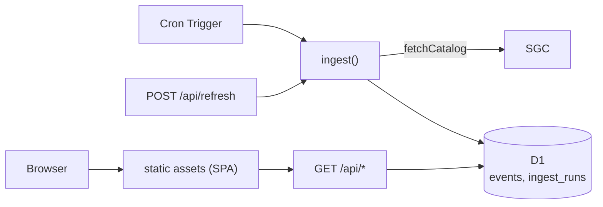

# Spec: Chocó swarm monitor on Cloudflare

> **Status (2026-09-18): implemented.** The Worker, D1 schema, cron ingest, API,
> React page, tests and CI/CD described here exist in this repo. Differences from
> this spec as built: core logic lives in `core/` (not `src/`, which holds the
> React app); the daily full re-read became an hourly rotating 7-day "sweep" so
> every invocation stays small; statistics are computed in the browser from
> `/api/events`, with `/api/stats` kept for checks. §5's "every 15 minutes" became
> every 5 for a day, once SGC's own publication lag was measured at 2–5 minutes, then went
> back to 15 — as one cron alternating a narrow 1-day window with the full trailing 3 days.
> See [ingest.md](ingest.md) and [sgc-data-source.md](sgc-data-source.md). Still open:
> §4.1, and measuring CPU time.

You are building the hosted part of this project end to end. A working, tested
proof of concept already exists in this repo. Read this whole file, then
`README.md`, then the code in `src/` before writing anything.

## 1. Purpose

A researcher is tracking the earthquake sequence in Chocó, Colombia (Sipí,
Istmina, Medio San Juan, Litoral del San Juan) that followed the M7.4 San José
del Palmar earthquake of 2026-08-10 12:34:27 UTC. They want to watch the
Gutenberg–Richter **b-value** (the slope of log10 N(≥M) = a − b·M) over time.

Deliver a public web page that shows the event catalogue as a table, a map and
charts, keeps itself up to date from the Servicio Geológico Colombiano (SGC), and
has a refresh button.

## 2. What is already built and proven (do not rewrite)

| File | What it does |
|---|---|
| `src/seiscomp.ts` | `buildFormBody`, `fetchCatalog`, `parseCatalogHtml`. Fetch + parse of the SGC catalogue. |
| `src/gr.ts` | `fmd`, `mcMaxCurvature`, `mcGoodnessOfFit`, `bValue`, `bValueWindows`. Pure maths. |
| `src/csv.ts` | `toCsv` / `fromCsv`. |
| `src/types.ts` | `SeismicEvent`, `CatalogQuery`, `CatalogPage`, `BBox`. |
| `src/cli.ts` | Node-only CLI. Not used by the Worker. |
| `test/` | 32 tests. Parser tests run against a real captured response (786 events). |

`seiscomp.ts`, `gr.ts`, `csv.ts` and `types.ts` use only `fetch`, `URLSearchParams`,
`AbortSignal.timeout` and the `htmlparser2` package, so they are meant to run
unchanged inside a Worker. **Reuse them by import. Do not fork the logic.**
If you restructure into a workspace (e.g. `packages/core`, `apps/worker`,
`apps/web`), move the files, keep the tests passing, and keep one copy.

Commands: `pnpm test`, `pnpm test:live` (hits SGC), `pnpm typecheck`,
`pnpm cli fetch --out data/events.csv`, `pnpm cli bvalue --input data/events.csv --windows`.

## 3. Facts about the data source (all verified live on 2026-09-18)

Endpoint: `POST https://bdrsnc.sgc.gov.co/paginas1/catalogo/Consulta_Experta_Seiscomp/consulta_sismo.php`,
form-encoded. No auth, no cookies, no CSRF token. Field names are in `buildFormBody`.

- **Dates must be `dd/mm/yyyy`.** Any other format returns HTTP 200 with zero rows and no error.
- The date filter is date-only and the end date is inclusive. Whether it is
  evaluated in UTC or Colombia time (UTC−5) is **not verified**: always query one
  day wider than you need on both ends and filter by `time` yourself.
- **No pagination and no row cap observed.** One response carries everything:
  swarm bbox since 2026-08-10 → 786 rows, ~0.8 MB, ~2 s. All of Colombia since
  2026-01-01 → 9,917 rows, ~10 MB, ~49 s.
- **The server sometimes repeats a row** (1 exact duplicate in the 9,917-row
  query). `parseCatalogHtml` collapses these and reports `duplicatesDropped`.
- **Use the bounding box, not the Departamento dropdown.** Posting
  `departamento=11-Chocó` returned 0 rows in testing.
- The HTML is malformed: `<center>` tags are never closed, `HREF` values are
  unquoted. DOM-building parsers choke on it (`node-html-parser` did not finish
  in 50 s on 0.8 MB). `htmlparser2` in streaming mode parses it in ~25 ms. Keep it.
- Event id (`SGC2026pqqmro`) exists **only** inside the row's link hrefs. The
  site's own CSV button and "Generar Excel" (`descargar_exel_experta.php`) omit
  the id and the manual/automatic status, which is why we scrape the HTML.
- The map link in each row carries unrounded lat/lon/depth; the parser prefers those.
- `solutionStamp` comes from the `date=` parameter of the phases link. It looks
  like a last-modified time for the solution. Its meaning and timezone are
  **not verified**. Use it only to detect that a row changed.
- Catalogue coverage starts 2018-03-01 (stated on the SGC form page).
- **The catalogue has a hard floor at M2.0** (67 events at M2.0, 2 below).
  M0–M2 events are not published here. Nothing can recover them from this source.
- Events are revised: `status` goes `automatic` → `manual`, and magnitude and
  location can change. Events can also disappear on review. Design for that (§5).

Dead end, do not use: the ArcGIS layer
`srvags.sgc.gov.co/.../catalogo_de_sismos_2/FeatureServer/0` is a historical
catalogue (1610 → 2020-12-30, M ≥ 3.5, 16,290 events). It has nothing for this sequence.

Be a polite client: one scheduled request per interval, a descriptive
`user-agent` (already set), never fan out requests per page view.

## 4. Architecture

One Worker serving static assets plus a JSON API, a D1 database, and a Cron Trigger.



Before writing config or bindings, load the `cloudflare`, `wrangler` and
`workers-best-practices` skills and check current Cloudflare docs. Treat limits
quoted here as things to confirm, not as facts.

### 4.1 First task: prove the Worker can reach SGC and parse in budget

This is the main unknown. Nothing so far has run from Cloudflare's network.
Before building anything else, deploy a minimal Worker that calls
`fetchCatalog` for the swarm bbox over the last 7 days and returns the event
count and timing. Two things can fail:

1. **SGC may block or throttle Cloudflare egress IPs.** If it does, stop and
   report. The fallback is a scheduled GitHub Action that runs the existing CLI
   and pushes rows to the Worker through an authenticated `POST /api/ingest`.
   Build that only if needed.
2. **CPU time.** Parsing the full 0.8 MB response took ~25 ms on a laptop. The
   Workers free plan's CPU limit per invocation is small (confirm the current
   figure in the docs). Design so it does not matter: the recurring job fetches
   only a short trailing window (§5), which is tens of KB. Measure real CPU time
   from the deployed Worker and record it in the README.

### 4.2 D1 schema

```sql
CREATE TABLE events (
  id              TEXT PRIMARY KEY,      -- SGC2026pqqmro
  time            TEXT NOT NULL,         -- ISO 8601 UTC
  lat             REAL NOT NULL,
  lon             REAL NOT NULL,
  depth_km        REAL NOT NULL,
  mag             REAL NOT NULL,
  mag_type        TEXT NOT NULL,
  phases          INTEGER,
  rms_s           REAL,
  gap_deg         REAL,
  err_lat_km      REAL,
  err_lon_km      REAL,
  err_depth_km    REAL,
  region          TEXT NOT NULL,
  status          TEXT NOT NULL,         -- manual | automatic
  solution_stamp  TEXT,
  first_seen_at   TEXT NOT NULL,
  updated_at      TEXT NOT NULL,         -- last time any field changed
  removed_at      TEXT                   -- set when SGC stops returning the event
);
CREATE INDEX events_time ON events(time);

CREATE TABLE ingest_runs (
  id            INTEGER PRIMARY KEY AUTOINCREMENT,
  started_at    TEXT NOT NULL,
  finished_at   TEXT,
  trigger       TEXT NOT NULL,           -- cron | manual | backfill
  window_start  TEXT NOT NULL,
  window_end    TEXT NOT NULL,
  ok            INTEGER NOT NULL DEFAULT 0,
  fetched       INTEGER,
  inserted      INTEGER,
  updated       INTEGER,
  removed       INTEGER,
  error         TEXT
);
```

Use migrations. Batch D1 writes (`db.batch`) and stay under D1's per-statement
bound-parameter limit; check the current limit.

## 5. Ingest rules

`ingest(windowStart, windowEnd, trigger)`:

1. Record an `ingest_runs` row. Call `fetchCatalog` with the swarm bbox
   (`CHOCO_SWARM_BBOX`) and the window widened by one day on each side.
2. Upsert by `id`. Update a row and bump `updated_at` only if a field actually
   changed. Never overwrite `first_seen_at`.
3. Removal: an event in D1 whose `time` lies strictly inside the *requested*
   window (not the widened margin) and which is absent from a **successful**
   response gets `removed_at`. If it reappears, clear `removed_at`. Never delete rows.
4. Safety: if the fetch or parse throws, write the error to `ingest_runs` and
   change nothing in `events`. `parseCatalogHtml` already throws on a layout
   change, a truncated response, or a count mismatch, so a broken scrape cannot
   wipe data. Additionally, skip the removal step and flag the run if a
   successful response would remove more than 20% of the events in its window.
5. Schedules:
   - every 15 minutes: trailing 3 days;
   - once a day: full window from 2026-08-10, to pick up late revisions. If
     this exceeds CPU limits, split it into consecutive 7-day windows across
     separate invocations.
6. `POST /api/refresh` runs the trailing-3-day ingest, but only if the last
   successful run is more than 5 minutes old; otherwise it returns the last run
   unchanged. The button must never let visitors hammer SGC.

## 6. API

All JSON, all reads from D1 only. Exclude `removed_at IS NOT NULL` rows by default.

| Route | Returns |
|---|---|
| `GET /api/events?from&to&minMag&status&includeRemoved` | Event array, ascending by time. The whole set is small; no pagination needed below ~20k rows. |
| `GET /api/stats?from&to&mc&status&excludeMainshock` | `{ count, fmd, mcMaxc, mcGft, b: {maxc, gft, given}, windows }` computed with `src/gr.ts`. |
| `GET /api/status` | Last ingest run, last successful run, newest event time, total events. |
| `POST /api/refresh` | Rate-limited ingest (§5.6), then the same body as `/api/status`. |
| `GET /api/events.csv` | Same filters as `/api/events`, via `toCsv`. |

Cache GET responses briefly (≤ 60 s). Validate and clamp every query parameter.

## 7. Web page

Single page, static assets served by the same Worker. Keep the stack light
(Vite + TypeScript; a framework is optional). Load the `dataviz` and
`frontend-design` skills before designing charts. Spanish UI labels with
English as a toggle is a nice-to-have; the researcher is Spanish-speaking.

Required:

1. **Status bar**: newest event time, last successful update ("hace 4 min"), event count, refresh button with loading and rate-limited states, and a visible error state when the last ingest failed.
2. **Filters** applied to everything below: date range, minimum magnitude, manual-only, exclude mainshock.
3. **Table**: sortable, all fields, CSV download, each row linking to the SGC event.
4. **Map** (Leaflet or MapLibre with an open tile source): circles sized by magnitude and coloured by depth; mainshock marked distinctly.
5. **Magnitude vs time** scatter, with daily event count.
6. **Frequency–magnitude plot**: cumulative and non-cumulative counts on a log axis, fitted G-R line, Mc marker, and `b ± σ` in the legend.
7. **b over time**: `bValueWindows` with a ±1σ band and a reference line at b = 1.

### Scientific guard-rails the UI must carry

These are requirements, not decoration. The numbers are easy to misread.

- Always show Mc and n beside any b. Show both Mc estimators. **The GFT
  estimator is unreliable here**: because the catalogue is cut off at M2.0, it
  picks Mc = 2.0 and returns a biased-low b (0.67 vs 0.75 with MAXC Mc = 2.3).
  Default to MAXC, let the user override Mc with a slider, and say why.
- b over time must use one fixed Mc across all windows. Say so on the chart.
- Grey out or flag any b computed from fewer than 50 events.
- State on the page: magnitudes mix types (MLr, MLv, Mw, M); events below M2.0
  are not published by SGC; completeness just after the mainshock is worse than
  later; recent events may still be `automatic` and can change; a b-value below
  1 is not a prediction. Link to SGC as the authoritative source and credit it.
- Reference figures from 2026-09-18 for a sanity check of your implementation:
  786 events; MAXC Mc = 2.3 → b = 0.750 ± 0.031 (n = 528); 150-event windows at
  Mc 2.3 drift from ~1.0 (mid-August) to ~0.58 (mid-September). Live numbers
  will differ as SGC revises the catalogue.

## 8. Testing and acceptance

- Existing 32 tests keep passing. `pnpm typecheck` clean.
- Worker tests with `@cloudflare/vitest-pool-workers` (confirm current setup in docs), using the fixture in `test/fixtures/` and a stubbed `fetch`:
  - first ingest inserts 786 rows; re-ingesting the same response changes nothing and bumps no `updated_at`;
  - a changed magnitude/status updates exactly that row;
  - an event missing from a later response gets `removed_at`; reappearing clears it;
  - a thrown fetch, an unparseable page, or a >20% removal leaves `events` untouched and records the error;
  - `/api/refresh` inside the 5-minute window does not call SGC;
  - `/api/stats` on the fixture returns the reference figures in §7.
- A deployed smoke test: `/api/status` shows a successful cron run with a newest event less than a day old, and the page renders all seven sections with real data on desktop and phone widths.

Done means: deployed URL, cron running, all tests green, README updated with
the URL, measured CPU time per ingest, and how to redeploy.

## 9. Out of scope

Waveform processing, template matching, other catalogues (USGS/ISC comparison
is a good follow-up), user accounts, alerts or notifications, any claim of
forecasting.

## 10. Needs the human

Cloudflare account login (`wrangler login`), choice of free vs paid plan if
§4.1 shows CPU limits bite, and the public hostname. Ask once, up front.
